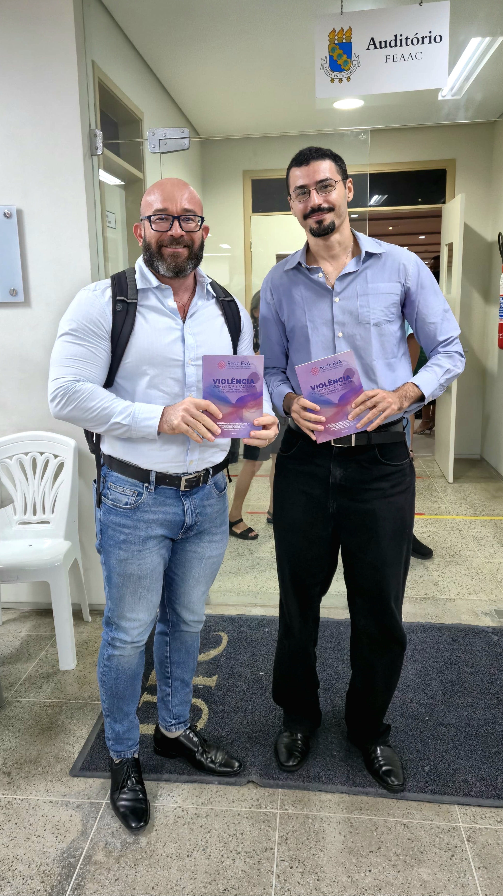
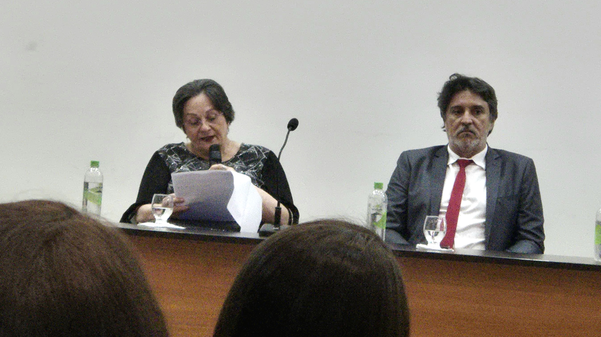
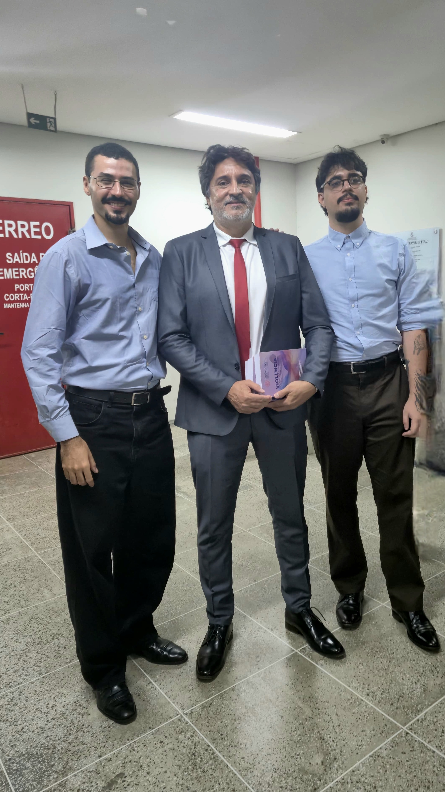
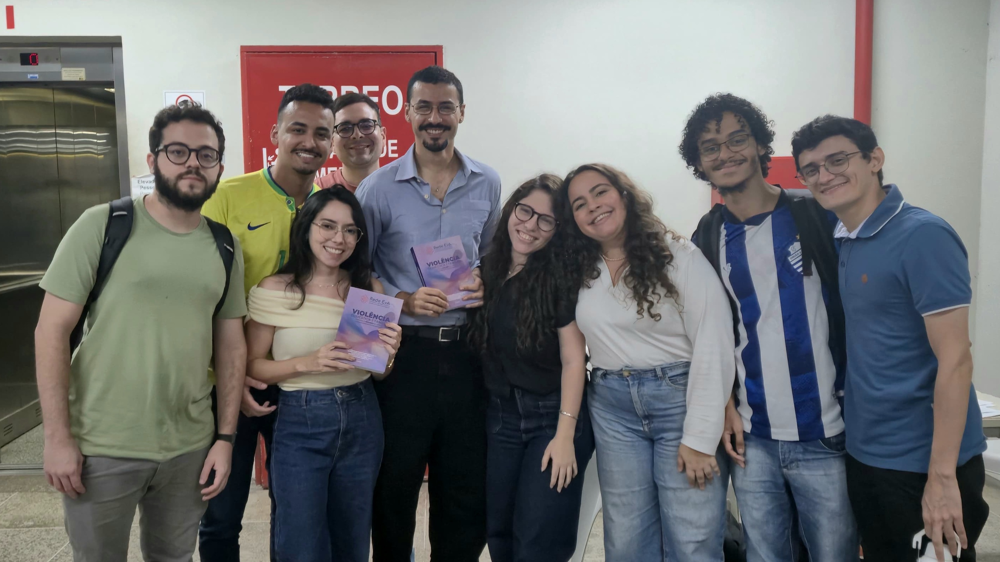

No último dia 24 de abril, às 19h, ocorreu o lançamento do livro Violência Doméstica e Familiar contra a Mulher no Brasil: Abordagens Interdisciplinares que contribui, junto com meu amigo Gabriel Cordeiro Holanda, com o Capítulo 6 — Determinantes da dinâmica de risco de violência por parceiro íntimo utilizando análise categórica de sequências.

{width=60%}

Esse trabalho é fruto da Rede EvA, constituída por pesquisadores de seis universidades brasileiras e pelo Instituto Maria da Penha, em um esforço colaborativo para construir evidências sólidas voltadas ao enfrentamento da violência doméstica contra a mulher no país. O evento contou com a presença da própria sra. Maria da Penha Fernandes, grande inspiradora da lei que leva seu nome e de muitas outras iniciativas de combate à violência doméstica no nosso país.

{width=60%}

O capítulo ao qual contribuo é baseado no meu Trabalho de Conclusão de Curso, orientado pelo professor Jose Raimundo Carvalho (UFC), que também é um dos organizadores da obra. No estudo, utilizamos dados da Pesquisa de Condição Socioeconômica e Violência Doméstica e Familiar contra a Mulher (PCSVDFMulher), um survey longitudinal que cobre nove capitais brasileiras e reúne informações detalhadas sobre esse fenômeno.

A PCSVDFMulher é o maior estudo empírico da América Latina na área de VDFCM, com forte orientação microeconômica e metodologias oriundas da saúde pública, estatística, ciências jurídicas, criminologia e sociologia. Esse estudo, liderado pela UFC, já coletou dados longitudinais e estatisticamente representativos em 13 capitais do Brasil, totalizando 40.000 entrevistas ao longo de quatro ondas (2016, 2017, 2019 e 2021/2023). Trata-se de esforço articulado e inédito para dar suporte a uma necessária e urgente política pública de enfrentamento à VDFCM no Brasil.

{width=60%}

Agradeço a toda a equipe envolvida no esforço de publicação desta obra e fico muito feliz em poder contribuir para o fortalecimento do corpo de evidências científicas no enfrentamento de um dos problemas mais graves da nossa sociedade.

{width=60%}
