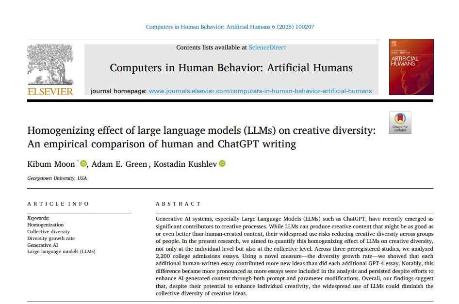
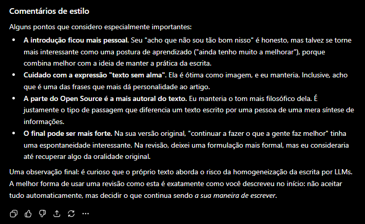

A principio, este blog tinha como objetivo servir de exercício para a programação em ciência de dados,mas hoje sinto uma necessidade adicional no cotidiano: de exercitar também a escrita criativa. No meio do trabalho técnico em manipular dados e apresentar indicadores, é importantíssimo saber comunicar corretamente as ideias por detrás dos números, e acho que não sou tão bom nisso. 

Portanto, a habilidade de saber escrever claramente um e-mail, um relatório, pontuar bem os textos em um slide, tudo contribui para que eu seja bem entendido.

E claro, como todo mundo hoje, utilizo bastante as LLMs para ajudar. Pra mim, elas funcionam como editores que eu mando meus textos ruins, crus, mas com minhas ideias principais já presentes e elas me devolvem sugestões de escrita, correções de gramática e ortografia, etc.

Tem funcionado bem, principalmente quando meu principal objetivo é evitar que o texto fique "sem alma". Essa falta de alma eu tenho percebido principalmente quando bato o olho em um texto que segue um "padrão" que apesar de ser difícil de descrever, é fácil de reconhecer.

# Tudo tende a ficar muito parecido

A origem desse padrão pôde ser descrita no paper recente de @moon2025. A questão de pesquisa é: Como LLMs como o ChatGPT se comparam com humanos enquanto entidades criativas?

A hipótese levantada e suportada pela literatura é que em nível individual, os modelos de IA tendem a produzir melhores textos, mas quando consideramos o conjunto da produção, ela tende a ser menos diversa, mais semelhante na escolha de termos, estruturas e ideias. Essa questão levou os autores a desenvolver métricas de criatividade baseadas em distância semântica para comparar a produção pré e pós introdução das LLMs.

Os resultados do artigo são muito interessantes. Nos estudos realizados, observa-se que a escrita humana aumentou a diversidade semântica no grupo de redações aproximadamente entre 2 e 8 vezes em relação àquela feita pelo GPT-4. Essa diferença permanece mesmo com modificações de prompts e parâmetros.

Mesmo que as IAs continuem evoluindo e produzam textos individualmente mais diversos, a tendência observada pelos autores é que, em comparação com humanos, as LLMs ainda contribuam para uma homogeneização das ideias quando analisamos a produção coletiva.

O texto completo pode ser acessado [aqui](https://www.sciencedirect.com/science/article/pii/S294988212500091X)

# Permanecer criativo

Nos últimos tempos tenho crido bastante que se a humanidade tem algum futuro, ele está na capacidade de construir coisas coletivamente. Ser um entusiasta de Open Source é, em certa medida, acreditar que existe uma construção coletiva do conhecimento em andamento, e mais que somente sua construção mas também seu registro e transmissão.

Eu escrevo porque quero deixar algo meu para quem lê. Não quero que uma LLM seja a autora das minhas ideias, mas que seja uma potencializadora das minhas capacidades. Entender isso enquanto pesquisador, artista amador e como um amigo que quer deixar algo para os seus tem sido fundamental.

Praticar escrita na minha atual situação profissional também tem outra vantagem: tokens são caros. Convenhamos que utilizar IA e agentes para construir coisas a partir de níveis muito básicos é, hoje, muito caro e facilmente se perde o controle sobre o processo. Então saber programar bem, e de acordo com o paper, escrever bem, também tem um efeito financeiro positivo.

No final das contas, tenho estado satisfeito em como as coisas estão caminhando, mas cada vez mais alerta sobre as ameaças que estão escondidas por aí no futuro. Continuar a fazer o que a gente faz de melhor, e ficar cada vez melhor nisso, é a única coisa que vai nos levar pra frente.

P.S. Eu revisei a gramática e a ortografia e estilo no GPT. O último parágrafo ele foi bem curioso, muito querido:
